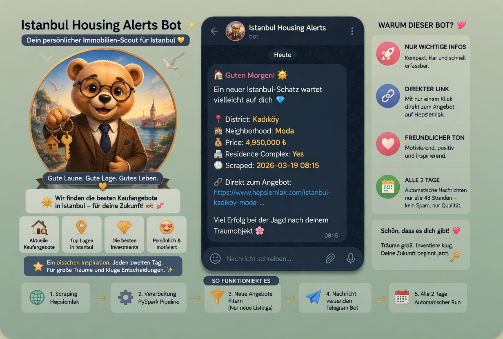
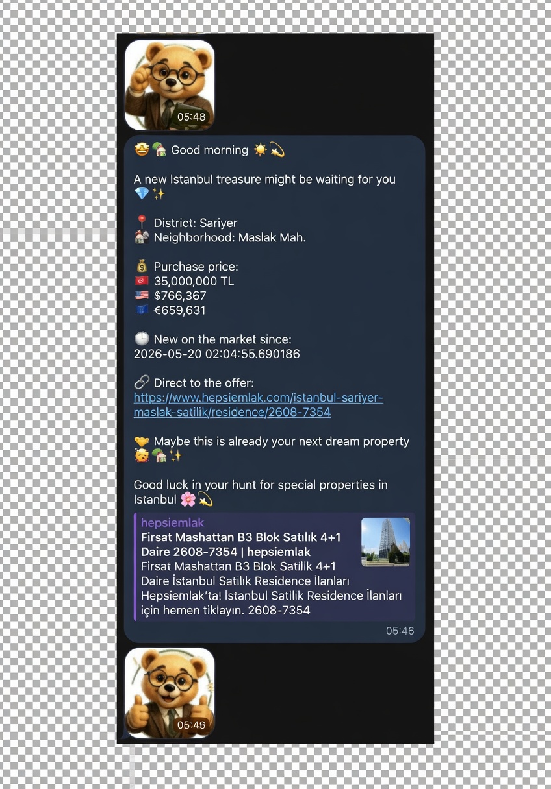
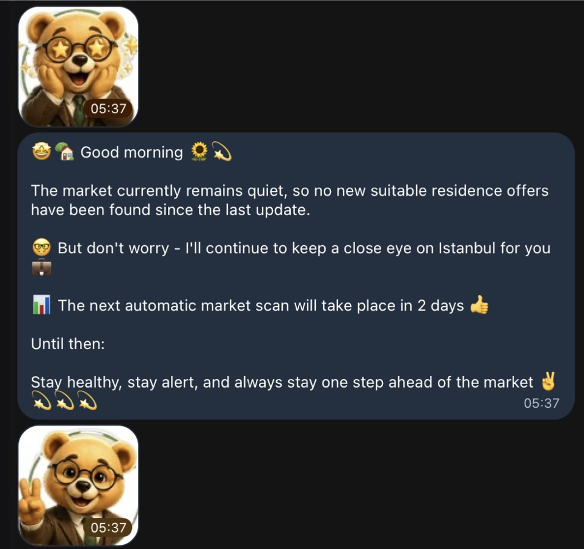

# Istanbul Housing Market Analytics Pipeline

**End-to-End Real Estate Analytics & Automation Project**

From web scraping to interactive dashboards and automated market monitoring.


---

## Project Overview

Developed an **end-to-end real estate analytics and automation pipeline** for the Istanbul housing market. 

Starting from a large scraped dataset from hepsiemlak.com, I designed and implemented a complete ETL process to clean, transform and structure the data. The project features two purpose-built Tableau dashboards and a fully automated Telegram Alert Bot that delivers intelligent market updates every 48 hours.

This project showcases both strong analytical skills and the ability to design scalable, production-oriented data engineering solutions.

---

## Skills Demonstrated

| Area                     | Skills Demonstrated |
|--------------------------|---------------------|
| **Data Engineering**     | Web Scraping, ETL Pipeline, Data Modeling, Automation, SQLite |
| **Data Analysis**        | Exploratory Analysis, Trend Detection, Market Segmentation |
| **Business Intelligence**| Tableau Dashboarding, Data Storytelling, KPI Development |
| **Automation**           | Scheduling, Telegram Bot Integration, Pipeline Orchestration |
| **Tools**                | Python, Pandas, PySpark, BeautifulSoup, Tableau, Git, Jupyter |

---

## Live Dashboards

### 1. Market Analytics Dashboard
**Comprehensive Market Analysis & Investment Insights**

[→ Open Tableau Dashboard](https://public.tableau.com/views/IstanbulHousingMarketAnalytics2026/IstanbulHousingMarketAnalytics2026)


This dashboard provides a deep exploratory analysis of the Istanbul housing market, covering pricing trends, district comparisons, property size efficiency, building age impact, and Asian vs European side differences.

---

### 2. Residence Listings Analysis
**Automated Pipeline Frontend & Market Monitoring Dashboard**

[→ Open Tableau Dashboard](https://public.tableau.com/views/IstanbulResidenceListingsAnalysis/IstanbulResidenceListingsAnalysis)


This dashboard was designed as the visual frontend for the automated ETL pipeline. It focuses on residence listings by district, average prices, time-based monitoring, and interactive filtering. Although full automation was limited by Tableau Public, the architecture was built for future scalability with Tableau Cloud or Server.

---

## Pipeline Architecture

<p align="center">
  
</p>

---

## Key Business Insights

- Significant price variation across districts (Bakırköy ~777k ₺/m² vs. Esenyurt ~35k ₺/m²)
- Smaller apartments achieve the highest price per m²
- New buildings (0–5 years) command a clear price premium
- Asian side shows slightly higher average prices per m²
- Luxury projects are concentrated in premium districts

---

## 📂 Project Structure

```bash
istanbul-housing-market-analytics-pipeline/
├── assets/
│   ├── architecture/              # Pipeline architecture diagrams
│   ├── bot/                       # Telegram bot assets & notifications
│   ├── dashboards/                # Tableau dashboard screenshots
│   └── screenshots/               # Additional project visuals
│
├── dashboards/                    # Tableau dashboard workbooks
│
├── data/
│   ├── raw/                       # Raw scraped datasets
│   ├── processed/                 # Cleaned & transformed datasets
│   ├── historical/                # Historical residence price tracking
│   ├── snapshots/                 # Daily pipeline snapshots
│   ├── exports/                   # CSV pipeline exports
│   └── istanbul_housing.db        # SQLite database
│
├── notebooks/
│   ├── 01_data_exploration.ipynb
│   └── 02_big_data_architecture.ipynb
│
├── scripts/
│   ├── alerts/                    # Telegram notification logic
│   ├── automation/                # Automated scheduling scripts
│   ├── processing/
│   │   └── exchange_rates.py      # Currency conversion logic
│   ├── scraping/
│   │   └── scrape_hepsiemlak.py   # Istanbul residence web scraping
│   └── run_pipeline.py            # Main ETL pipeline execution
│
├── tests/
│   └── test_connection.py
│
├── presentation/                  # Final project presentation
├── run_full_pipeline.sh           # Full automation runner
├── requirements.txt
├── README.md
└── LICENSE
```

## 🤖 Automated Telegram Alert Bot

The **Istanbul Housing Alerts Bot** is a standout feature of this project — it successfully combines solid **data engineering** with a thoughtful **user-centric product experience**. Every 48 hours, the fully automated pipeline scrapes new real estate listings from Istanbul, processes them intelligently, and delivers curated, relevant notifications directly via Telegram. This transforms the project from static analysis into an active, near real-time market monitoring tool.

---

### Bot Profile & Branding

**🧸 Bot Profile**  
<p align="center">

</p>
The custom-designed bot profile serves as the intelligent communication layer of the Istanbul Housing Analytics Pipeline. It integrates automated scraping, PySpark-based data processing, historical listing comparison, smart filtering, and Telegram delivery.

**🎨 Bot Branding & Workflow**  
<p align="center">

</p>
A complete visual identity and branding concept was developed to create a modern and engaging user experience. The design combines friendly storytelling, clean message formatting, and a helpful automated market assistant personality.

---

### Notification Examples

**📬 New Residence Alert**  
<p align="center">

</p>
When new listings are detected, the bot sends a detailed notification including district, neighborhood, residence complex, price, scraping timestamp, and a direct link to the offer on hepsiemlak.com.

**📊 No-New-Listing Notification**  
<p align="center">

</p>
If no new opportunities are found, the bot sends a friendly market status update instead of spamming the user. This creates a clean and professional notification experience.

---

### 🔄 Automated Workflow

Every 48 hours the system automatically executes the full cycle:
- Scrapes new Istanbul residence listings
- Cleans and processes the incoming data
- Compares with historical records
- Identifies only newly added properties
- Converts prices and sends personalized notifications

---

### 🧠 Smart Notification Logic

The bot intelligently distinguishes between different situations to provide real value:
- New residence opportunities
- No-change market updates
- Historical market tracking
- Regular automated monitoring cycles

---

### 💱 Multi-Currency Price Conversion

All property prices are automatically converted for better international usability:
- 🇹🇷 Turkish Lira (TRY)
- 🇪🇺 Euro (EUR)
- 🇺🇸 US Dollar (USD)

The conversion logic is implemented in `scripts/processing/exchange_rates.py`.

---

### 🐻 Custom Emoji System

<p align="center">


</p>
Custom-designed mascot reactions were created to make the notifications more engaging, human, and friendly while keeping a professional tone.