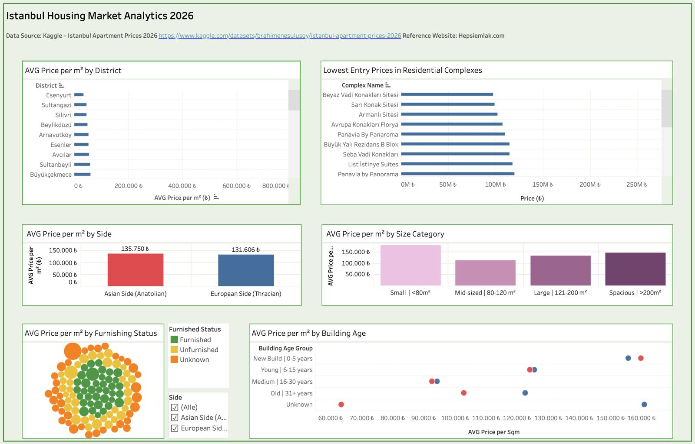
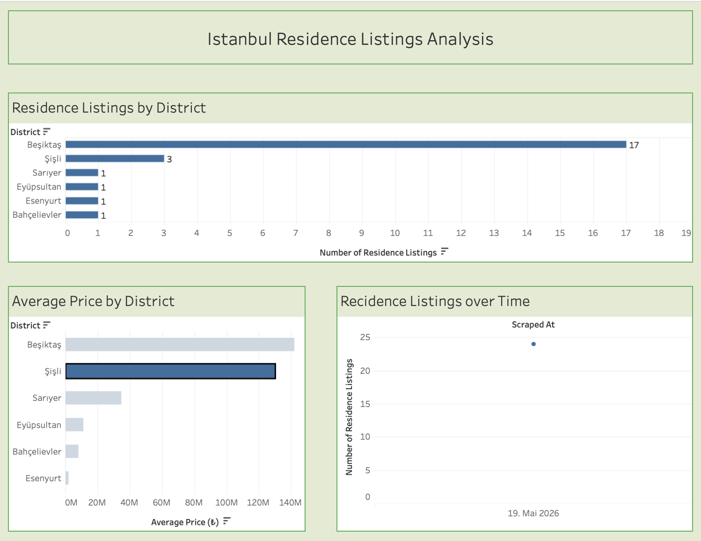
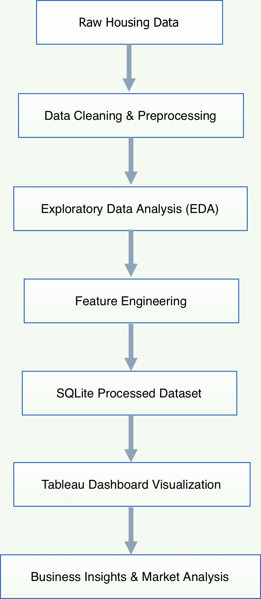

# Istanbul Housing Market Analytics Pipeline

**End-to-end Real Estate Analytics Pipeline**  
From Raw Data to Business Insights using Modern Data Engineering Tools


[](https://public.tableau.com/views/IstanbulHousingMarketAnalytics2026/IstanbulHousingMarketAnalytics2026)

## Live Dashboard

Interactive Tableau dashboards for exploring Istanbul housing market trends and analytics.

## Dashboard Previews

### Market Analytics Dashboard – Istanbul Housing Market Analytics 2026



🔗 Tableau Dashboard:
https://public.tableau.com/views/IstanbulHousingMarketAnalytics2026/IstanbulHousingMarketAnalytics2026

---

### Residence Listings Dashboard – Istanbul Residence Listings Analysis



🔗 Tableau Dashboard:
https://public.tableau.com/views/IstanbulResidenceListingsAnalysis/IstanbulResidenceListingsAnalysis

## Pipeline Architecture

<p align="center">
  <br>
  <br>
  
  <br>
  <br>
</p>
                                                                              
## Project Overview

This project analyzes the Istanbul housing market using an end-to-end data analytics pipeline built with Python, SQL, and Tableau.

The pipeline processes more than 24,000 housing listings and transforms raw real estate data into actionable business insights through data cleaning, exploratory analysis, and interactive dashboard visualization.

The project aims to identify:
- Pricing trends across Istanbul districts
- High-value investment opportunities
- Property distribution patterns
- Market segmentation insights

## Project Structure

```bash
istanbul-housing-market-analytics-pipeline/
├── data/              # Raw and processed datasets
├── 02_notebooks/         # Jupyter Notebooks (Exploration & Analysis)
├── scripts/           # Python Scripts (ETL, Processing)
├── dashboards/        # Tableau Workbooks
├── assets/            # Screenshots & Visuals
├── presentation/      # Abschlusspräsentation
├── requirements.txt      # Python Dependencies
└── README.md
